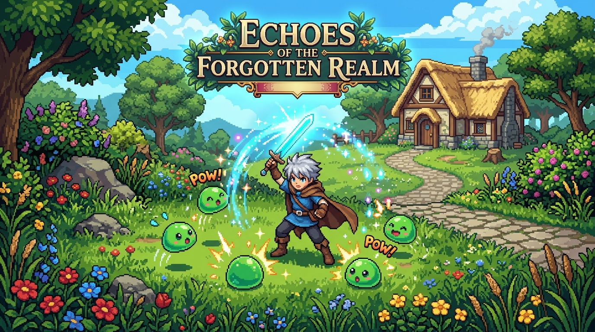

# Echoes of the Forgotten Realm

An anime-inspired 2D top-down action RPG web game built with **Phaser 4**, **TypeScript**, and **Vite**.



---

## 🌟 Game Overview

Awaken as **Aster** in the sunlit trails of Whispering Meadow with hazy memories. Journey through mystical woods, battle rogue slimes and ferocious shadow wolves, assist village guides and elders, unearth ancient treasures, and face the towering three-phase titan—the **Ancient Guardian**—to restore the memories of the realm.

### Key Features

- **Real-Time 2D Combat**: Fast-paced directional melee swings, knockback physics, critical strikes, and the devastating **Arc Burst** area-of-effect special skill.
- **Dynamic 3-Phase Boss Fight**: Encounter the Ancient Guardian featuring escalating mechanics: Phase 1 melee rush, Phase 2 ground slam shockwaves with arcane barrier shields, and Phase 3 enraged strikes with screen shake.
- **Quest Progression**: Dynamic quest log with multi-step objectives, NPC dialogue triggers, and XP/coin/equipment rewards.
- **Rich Inventory & Equipment**: Item stacking, consumables (potions, wild herbs), equipment slots (weapon, armor, accessories) that dynamically alter attack, defense, crit chance, and speed.
- **Seamless 3-Zone Exploration**: Travel between Whispering Meadow, Moonlit Forest, and Ancient Ruins with smooth transitions and camera tracking.
- **Procedural Audio & Visuals**: 100% self-contained synthesized Web Audio sound effects (slashes, magic blasts, chimes, fanfares, dialogue beeps) and atmospheric ambient background themes with zero missing 404s.
- **Cross-Platform Responsive Controls**: Desktop keyboard (WASD/Arrows + J/K/E/I/ESC) and mobile virtual joystick with on-screen action buttons.
- **Versioned Save System**: Autosaves upon map transitions plus manual save/load via `localStorage` with corrupted data resilience.

---

## 🎮 Controls

### Desktop Keyboard

| Action | Primary Key | Secondary Key |
|---|---|---|
| **Move** | `W` / `A` / `S` / `D` | `↑` / `←` / `↓` / `→` |
| **Basic Attack** | `J` | Left Click (Virtual Button) |
| **Arc Burst (Skill)** | `K` (Cost: 25 MP) | Virtual Button |
| **Interact / Advance** | `E` / `SPACE` | Virtual Button |
| **Open Inventory** | `I` | Top Bar Bag Icon |
| **Pause Menu** | `ESC` | Top Bar Pause Icon |

### Mobile & Touch Devices

- **Virtual Joystick**: Bottom-left corner (touch and drag to guide Aster).
- **Action Buttons**: Bottom-right buttons (`ATK`, `SKILL`, `USE`).
- **Quick Menu**: Top-right icons for Inventory, Quests, and Pause.
- Can be toggled on/off in **Settings**.

### Developer Debug Keys

- `F1`: Toggle physics hitbox debug visualization
- `F2`: +100 EXP (tests leveling curve)
- `F3`: +100 Coins
- `F4`: Teleport between zones (Meadow ⇄ Forest ⇄ Ruins)
- `F5`: Instantly restore full HP & MP
- `F6`: Spawn additional enemy

---

## 🛠️ Technology Stack

- **Game Engine**: [Phaser](https://phaser.io/) (v4.2.1)
- **Language**: TypeScript 5.7
- **Bundler & Dev Server**: Vite 6
- **Audio Engine**: Web Audio API (real-time procedural synthesis)
- **Styling**: Vanilla CSS3 + Google Fonts (`Cinzel`, `Outfit`)

---

## 🚀 Getting Started

### Prerequisites

- **Node.js**: v18.0 or newer
- **npm**: v9.0 or newer

### Installation

```bash
npm install
```

### Development Server

Start the local Vite dev server with hot module reloading:

```bash
npm run dev
```

Visit `http://localhost:3000` in your browser.

### Production Build

Compile TypeScript and build the optimized production bundle:

```bash
npm run build
```

Preview the production build locally:

```bash
npm run preview
```

---

## 📁 Project Architecture

```text
├── index.html                    # Entry HTML & canvas mount
├── package.json                  # Dependencies & scripts
├── tsconfig.json                 # TypeScript compiler options
├── vite.config.ts                # Vite configuration
│
└── src/
    ├── main.ts                   # Bootstraps Phaser.Game
    ├── config/
    │   └── gameConfig.ts         # Phaser resolution, scenes, physics config
    ├── types/
    │   └── game.ts               # Core TypeScript interfaces & types
    ├── utils/
    │   ├── constants.ts          # Resolution, stats, colors, keys
    │   ├── math.ts               # XP curve, damage & crit formulas
    │   └── AssetGenerator.ts     # Procedural canvas sprite/portrait generator
    ├── data/
    │   ├── items.ts              # Item database & equipment stats
    │   ├── enemies.ts            # Slime, Wolf, and Guardian configs
    │   ├── quests.ts             # 4 main quest definitions
    │   ├── dialogues.ts          # Mira, Rowan, and Elder dialogue trees
    │   └── maps.ts               # Tile, obstacle, and transition configs
    ├── systems/
    │   ├── AudioSystem.ts        # Web Audio oscillator SFX & BGM synthesis
    │   ├── CombatSystem.ts       # Melee, Arc Burst, damage & knockback
    │   ├── InventorySystem.ts    # Stacking, equipment bonuses, consumables
    │   ├── QuestSystem.ts        # Objectives tracking & reward granting
    │   ├── SaveSystem.ts         # Versioned localStorage serializer
    │   └── InputSystem.ts        # Desktop & virtual touch joystick inputs
    ├── entities/
    │   ├── Player.ts             # Aster: movement, stats, level up, death
    │   ├── Enemy.ts              # AI state machine (Idle, Patrol, Chase, Attack)
    │   ├── BossEnemy.ts          # Ancient Guardian 3-phase boss logic
    │   ├── NPC.ts                # Friendly interactable villagers
    │   └── Chest.ts              # Openable chests with loot drops
    ├── ui/
    │   ├── DialogBox.ts          # Typewriter text with portraits & skipping
    │   └── Notification.ts       # Animated banner popups
    └── scenes/
        ├── BootScene.ts          # Asset generation & texture registration
        ├── MainMenuScene.ts      # Title screen & continue handler
        ├── IntroScene.ts         # Story prologue with spacebar skip
        ├── GameScene.ts          # Main world gameplay & map orchestrator
        ├── UIScene.ts            # Parallel HUD overlay & mobile controls
        ├── PauseScene.ts         # Pause modal & quick save
        ├── InventoryScene.ts     # Bag & equipment slot interface
        ├── QuestScene.ts         # Quest tracker modal
        ├── SettingsScene.ts      # Volume sliders & control toggles
        ├── GameOverScene.ts      # Defeat retry & reload screen
        └── VictoryScene.ts       # Boss victory ceremony & exploration
```

---

## 💾 Save System

Game progression is saved to browser `localStorage` under `echoes_rpg_save_v1`:

- Player position, facing direction, and current zone
- Current HP, MP, Level, EXP, and Coins
- Inventory items and equipped items (Weapon, Armor, Accessory)
- Active and completed quest states
- Opened chest IDs (chests cannot be repeatedly opened)
- Defeated boss state
- Audio and visual preferences

**Autosave**: Automatically triggers whenever the player enters a new zone or defeats the boss.
**Manual Save**: Accessible at any time via the Pause Menu (`ESC` -> `SAVE GAME`).

---

## 🎨 Asset Replacement Guide

All game sprites and textures are procedurally generated in `src/utils/AssetGenerator.ts` into Phaser's Texture Manager at boot time. To use external PNG or sprite sheet assets:

1. Place image files into `public/assets/`.
2. In `src/scenes/BootScene.ts`, replace or supplement the generator calls with standard Phaser loader calls:
   ```ts
   this.load.image('player_down', 'assets/characters/player_down.png');
   this.load.spritesheet('enemy_slime', 'assets/enemies/slime.png', { frameWidth: 32, frameHeight: 32 });
   ```
3. The existing entity classes (`Player.ts`, `Enemy.ts`, `Chest.ts`) will automatically use the loaded textures without code changes.

---

## 🔮 Future Expansion Ideas

- Magic projectile spells (Fireball, Ice Lance)
- Vendor shopkeeper NPC to buy and sell gear
- Mini-dungeon with switch puzzles and locked doors
- Additional enemy variants (Forest Spiders, Spectral Knights)
